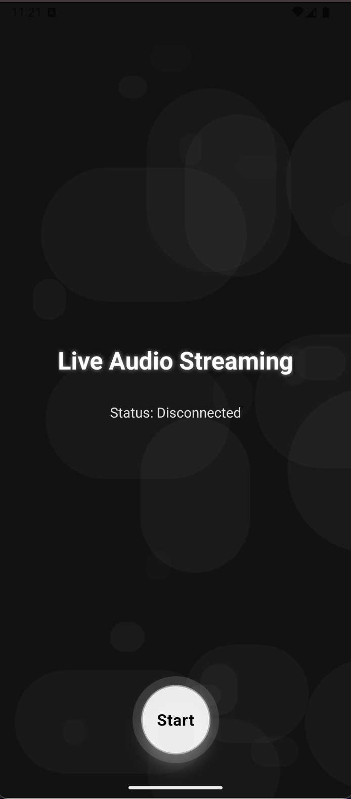
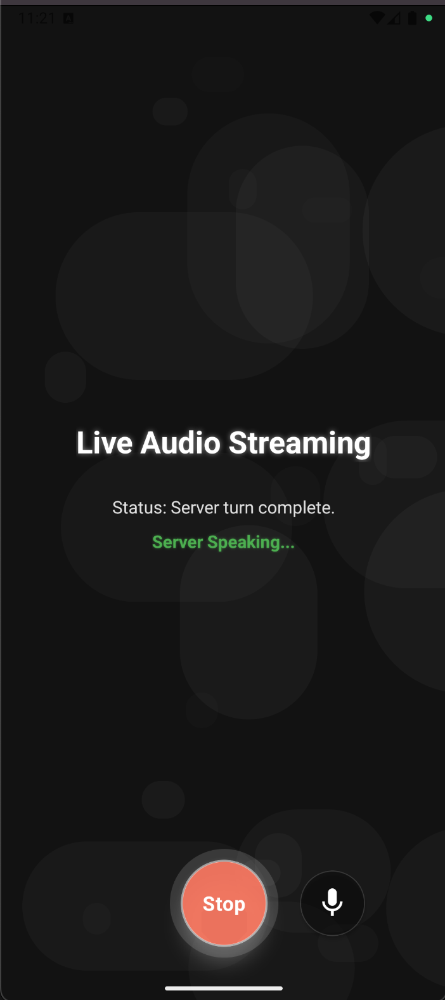
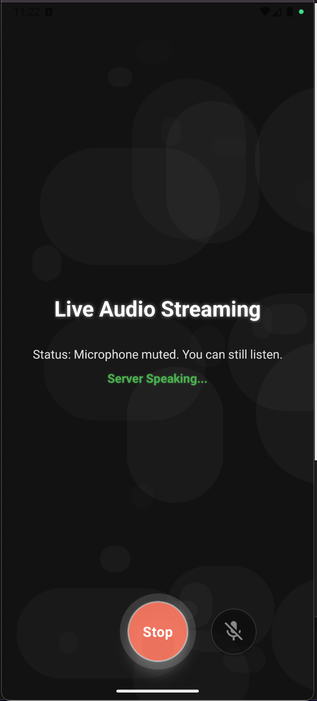

# Gemini Live API Bidirectional Audio Streaming App

A React Native (Expo) application for real-time, bidirectional audio streaming with the Google Gemini Live API ([BidiGenerateContent](https://ai.google.dev/api/live)).

- Uses Gemini Live API with Websocket for streaming audio and text.
- Implements the [BidiGenerateContent](https://ai.google.dev/api/live) endpoint for bidirectional, low-latency communication.
- Can be used as a smart AI assistant for natural, conversational experiences.
- Uses gemini-2.0-flash-live-001 model.


Speak to Gemini and hear AI-powered responses played back through your device's main loudspeaker, enabling a natural, conversational experience. Features a sleek, modern UI with a dark textured background and intuitive controls.

---
<div align="center">
  
  
  
</div>

## Features

- **Real-time Streaming:**
  - Streams microphone audio to Gemini Live API over WebSocket.
  - Receives and plays back Gemini's AI-generated audio responses instantly.

- **Acoustic Echo Cancellation (AEC):**
  - Implements echo cancellation to prevent audio feedback loops.
  - Eliminates the problem of the microphone picking up speaker output.

- **Transcript Popup:**
  - View a live transcript of your conversation in a chat-like popup.
  - User messages appear as green bubbles on the right, AI messages as dark bubbles on the left.
  - Transcript logs both your speech and the AI's responses in real time.
  - Easily accessible with a dedicated Transcript button next to the Start button.

- **Mute Button:**
  - Mute/Unmute the microphone to control audio input.
  - Doesnt close the connection with Gemini Live API; only stops sharing audio with it.
  - Even when muted, the app continues to receive and play back AI responses which were already generated.

- **Speaker Routing:**
  - Forces playback through the bottom-firing (loud) speakers, not the earpiece.
  - Includes robust fallback mechanisms to ensure proper audio routing.

- **High Volume & Clarity:**
  - Ensures maximum volume and clear audio output.
  - Maintains voice quality while preventing echo/feedback issues.

- **Robust Audio Pipeline:**
  - Handles audio session activation, permissions, and resource cleanup.
  - Gracefully manages audio processing and routing across different devices.
 
- **Modern UI Design:**
  - Dark textured background with subtle visual elements
  - Intuitive circular glowing button for easy interaction
  - Clean, readable typography with visual feedback


---

## Architecture Overview

```
                          [WebRTCAudioService (AEC)]
                                    |
[User] <--> [AudioInputService] <--> [WebSocketService] <--> [Gemini Live API]
                                              |
                                    [AudioOutputService]
                                              |
                                    [Loudspeaker Output]
```


## Setup & Installation

1. **Clone the repository:**

2. **Install dependencies:**
   ```sh
   npm install
   ```
3. **Configure API Key and Model:**
   - Set your Google Gemini API key and model in `config.js`.

4. **Development Build (required for native modules):**
   - Make sure you have EAS CLI installed.
   - Build a development client:
     ```sh
     npx eas build --platform ios --profile development
     # or for Android
     npx eas build --platform android --profile development
     ```
   - Install the build on your device.

5. **Run the App:**
   ```sh
   npx expo start --dev-client
   # Scan the QR code with your development build
   ```

---

## Usage

- Press the glowing circular button at the bottom of the screen to start a conversation.
- The button changes color to indicate active status (white for start, red for stop).
- Your voice is streamed to Gemini and you'll hear the AI's response played through the main speaker.
- Visual indicators show when the AI is speaking and the current status.
- All audio is routed through the loudspeaker for maximum clarity.
- **To view the transcript, tap the Transcript button next to Start/Stop. The popup will show a live chat log of your conversation.**

---

## Known Limitations
- **Audio Fragmentation:**
  - Playback may sound fragmented due to chunked streaming and limitations of expo-av. For seamless streaming, a lower-level audio API or native module would be required(ToDo).
---

## License
MIT

---

## Credits
- Powered by Google Gemini Live API
- Built with Expo, React Native, and open source libraries
